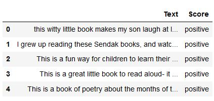
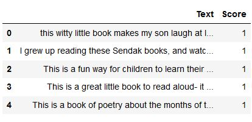
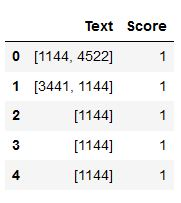
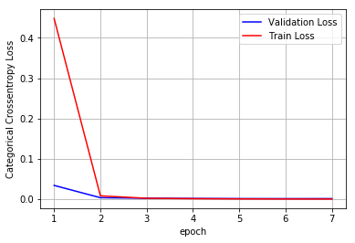

# LSTM on Amazon Food Reviews Dataset

### Dataset Details :

- Context

This dataset consists of reviews of fine foods from amazon. The data span a period of more than 10 years, including all ~500,000 reviews up to October 2012. Reviews include product and user information, ratings, and a plain text review. It also includes reviews from all other Amazon categories.

- Contents

Reviews.csv: Pulled from the corresponding SQLite table named Reviews in database.sqlite
database.sqlite: Contains the table 'Reviews'

#### Data includes:
- Reviews from Oct 1999 - Oct 2012
- 568,454 reviews
- 256,059 users
- 74,258 products
- 260 users with > 50 reviews

#### Link to dataset
https://www.kaggle.com/snap/amazon-fine-food-reviews

#### Steps to solve the problem:

- Text Preprocessing: Stemming, stop-word removal and Lemmatization.
- As dataset is imbalanced, sampled equal datapoints for both the classes.
- Filtered only the 'Text Reviews' and 'Score' column from the dataset which we will require for modelling
- Below is the snapshot of data. 

- The score (review labels) are "positive" and "negative".
- Encoded the review labels into 0 or 1
- Below is the sanpshot after encoding labels. 

### Need to convert text reviews into vectors for modelling

- Created a corpus of all words to give each word a index value.
- Selected only top frequent 10k words from 152k words for this purpose.
- Embedded each word with an index value similar to IMDB dataset in keras, and converted the review sentence into vector of indexes.
- Below if the representation of reviews in vector form. 
  
- The maximum review vector length is 115.
- Perform padding ,so that each review vector is of uniform length i.e 115
- If there is no padding ,each review will be of non uniform size.
- We have to send each of the word through the network and backpropagate for each of them.
- If we do this, i.e one word(batch) at a time this will be too slow
- We can combine to sequences as batch and pass the whole sequence at once to the network.
- If all the reviews are of uniform length then we can combine them into batches.
- Padding is done to combine sequences as batches, this will speedup our training.

## Building the LSTM architecture

- Split the data into train and test.
- First layer, we are adding is a Embedding layer.
- Embedding layer turns positive integers(indexes) into dense vectors of fixed size.
- This layer can only be used as a first layer in the model.
- Embedding layer can be thought of as BOW, tfidf or Word2Vec. 

-  100% Accuracy Graph with 1 LSTM layer with 100 cells and batch size = 1024  

